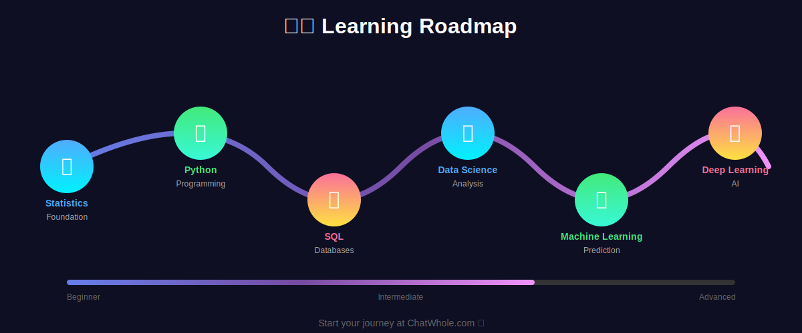
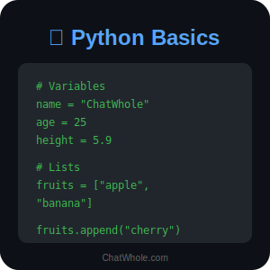
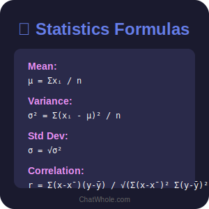
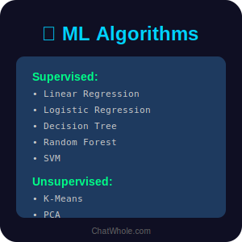

# 🚀 Data Science & AI Complete Learning Hub

<p align="center">
  
</p>

<p align="center">
  <strong>🎯 Master Data Science, AI & Machine Learning with Beautiful Visual Cheat Sheets</strong>
</p>

<p align="center">
  <a href="https://chatwhole.com">🌐 Visit ChatWhole.com</a> • 
  <a href="https://chatwhole.com/data-science">📊 Data Science Tutorials</a> • 
  <a href="https://chatwhole.com/python">🐍 Python Guides</a> • 
  <a href="https://chatwhole.com/machine-learning">🤖 ML Resources</a>
</p>

---

## 📚 Complete Learning Roadmap

<p align="center">
  
</p>

### 🎯 Quick Navigation

| Topic | Level | Cheat Sheet | Tutorial | Website |
|-------|-------|-------------|----------|---------|
| 📊 **Statistics** | Beginner → Advanced | [View SVG](statistics/statistics-cheat-sheet.svg) | [README](statistics/README.md) | [ChatWhole](https://chatwhole.com/statistics) |
| 🐍 **Python** | Beginner → Advanced | [View SVG](python/python-cheat-sheet.svg) | [README](python/README.md) | [ChatWhole](https://chatwhole.com/python) |
| 🤖 **Machine Learning** | Intermediate → Advanced | [View SVG](machine-learning/ml-cheat-sheet.svg) | [README](machine-learning/README.md) | [ChatWhole](https://chatwhole.com/machine-learning) |
| 🧠 **Deep Learning** | Advanced | [View SVG](deep-learning/deep-learning-cheat-sheet.svg) | [README](deep-learning/README.md) | [ChatWhole](https://chatwhole.com/deep-learning) |
| 📈 **Data Science** | All Levels | [View SVG](data-science/data-science-cheat-sheet.svg) | [README](data-science/README.md) | [ChatWhole](https://chatwhole.com/data-science) |
| 🗄️ **SQL** | Beginner → Advanced | [View SVG](sql/sql-cheat-sheet.svg) | [README](sql/README.md) | [ChatWhole](https://chatwhole.com/sql) |
| 📊 **Data Visualization** | Beginner → Advanced | [View SVG](data-visualization/dataviz-cheat-sheet.svg) | [README](data-visualization/README.md) | [ChatWhole](https://chatwhole.com/data-visualization) |

---

## 🌟 Featured SVG Cheat Sheets

<p align="center">
  
  
  
</p>

---

## 📖 How to Use This Repository

### 🎓 For Beginners
1. Start with **[Statistics](statistics/README.md)** - Foundation of Data Science
2. Learn **[Python](python/README.md)** - The programming language
3. Practice **[SQL](sql/README.md)** - Database querying

### 🚀 For Intermediate
4. Master **[Data Science](data-science/README.md)** - Complete pipeline
5. Explore **[Data Visualization](data-visualization/README.md)** - Storytelling with data
6. Build **[Machine Learning](machine-learning/README.md)** - Predictive models

### 🧠 For Advanced
7. Dive into **[Deep Learning](deep-learning/README.md)** - Neural networks & AI

---

## 🔗 Important Links

<p align="center">
  <a href="https://chatwhole.com">
    
  </a>
</p>

| Resource | Description | Link |
|----------|-------------|------|
| 🌐 **ChatWhole.com** | Main Website & Tutorials | [Visit](https://chatwhole.com) |
| 📊 **Data Science Course** | Complete Data Science Bootcamp | [Start Learning](https://chatwhole.com/data-science) |
| 🐍 **Python Tutorial** | Python for Data Science | [Learn Python](https://chatwhole.com/python) |
| 🤖 **ML Course** | Machine Learning Masterclass | [Master ML](https://chatwhole.com/machine-learning) |
| 🧠 **DL Course** | Deep Learning Specialization | [Deep Dive](https://chatwhole.com/deep-learning) |
| 📈 **Statistics Course** | Statistics Fundamentals | [Study Stats](https://chatwhole.com/statistics) |
| 🗄️ **SQL Course** | Database Mastery | [Query Data](https://chatwhole.com/sql) |

---

## 📥 Download All Cheat Sheets

Download all SVG cheat sheets as a zip:

```bash
git clone https://github.com/chatwhole/learning-hub.git
cd learning-hub/github_content
```

---

## 🤝 Contributing

We welcome contributions! Please read our [Contributing Guidelines](CONTRIBUTING.md) first.

## 📄 License

This project is licensed under the MIT License - see the [LICENSE](LICENSE) file for details.

---

<p align="center">
  Made with ❤️ by <a href="https://chatwhole.com">ChatWhole.com</a>
</p>

<p align="center">
  
</p>
