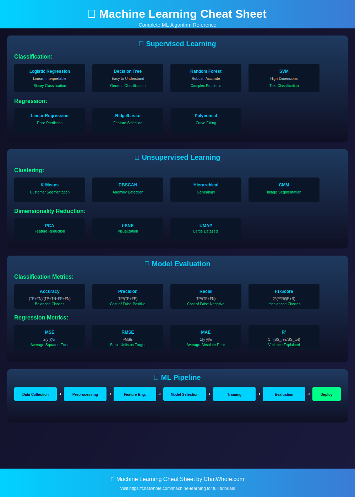

# 🤖 Machine Learning

<p align="center">
  
</p>

## 📚 Table of Contents

1. [Supervised Learning](#supervised-learning)
2. [Unsupervised Learning](#unsupervised-learning)
3. [Model Evaluation](#model-evaluation)
4. [Feature Engineering](#feature-engineering)

---

## 🎯 Supervised Learning

### Classification Algorithms

| Algorithm | Pros | Cons | Use Case |
|-----------|------|------|----------|
| **Logistic Regression** | Simple, interpretable | Linear boundaries | Binary classification |
| **Decision Tree** | Easy to understand | Overfitting | General classification |
| **Random Forest** | Robust, accurate | Less interpretable | Complex problems |
| **SVM** | Effective in high dims | Slow on large data | Text classification |
| **KNN** | Simple, no training | Slow prediction | Small datasets |
| **Naive Bayes** | Fast, works well | Independence assumption | Spam filtering |

### Regression Algorithms

| Algorithm | Pros | Cons | Use Case |
|-----------|------|------|----------|
| **Linear Regression** | Simple, interpretable | Assumes linearity | Price prediction |
| **Ridge/Lasso** | Handles multicollinearity | Less interpretable | Feature selection |
| **Polynomial** | Captures non-linearity | Overfitting risk | Curve fitting |
| **SVR** | Robust to outliers | Computationally expensive | Complex regression |

---

## 📊 Unsupervised Learning

### Clustering

| Algorithm | Pros | Cons | Use Case |
|-----------|------|------|----------|
| **K-Means** | Fast, scalable | Must specify k | Customer segmentation |
| **DBSCAN** | Finds任意形状 | Sensitive to params | Anomaly detection |
| **Hierarchical** | No need to specify k | Computationally expensive | Genealogy |
| **GMM** | Soft clustering | Assumes Gaussian | Image segmentation |

### Dimensionality Reduction

| Algorithm | Pros | Cons | Use Case |
|-----------|------|------|----------|
| **PCA** | Preserves variance | Linear only | Feature reduction |
| **t-SNE** | Preserves local structure | Non-parametric | Visualization |
| **UMAP** | Fast, scalable | Requires tuning | Large datasets |

---

## 📈 Model Evaluation

### Classification Metrics

| Metric | Formula | When to Use |
|--------|---------|-------------|
| **Accuracy** | (TP+TN)/(TP+TN+FP+FN) | Balanced classes |
| **Precision** | TP/(TP+FP) | Cost of false positive high |
| **Recall** | TP/(TP+FN) | Cost of false negative high |
| **F1-Score** | 2*(P*R)/(P+R) | Imbalanced classes |
| **AUC-ROC** | Area under ROC curve | Overall performance |

### Regression Metrics

| Metric | Formula | Interpretation |
|--------|---------|----------------|
| **MSE** | Σ(y-ŷ)²/n | Average squared error |
| **RMSE** | √MSE | Same units as target |
| **MAE** | Σ|y-ŷ|/n | Average absolute error |
| **R²** | 1 - (SS_res/SS_tot) | Variance explained |

### Cross-Validation

```python
from sklearn.model_selection import cross_val_score

scores = cross_val_score(model, X, y, cv=5)
print(f"Accuracy: {scores.mean():.2f} (+/- {scores.std():.2f})")
```

---

## 🔧 Feature Engineering

### Common Techniques

| Technique | Description | When to Use |
|-----------|-------------|-------------|
| **Scaling** | Normalize features | Distance-based algorithms |
| **Encoding** | Convert categories | Categorical features |
| **Imputation** | Handle missing values | Missing data |
| **Feature Selection** | Remove irrelevant features | High dimensionality |
| **Polynomial Features** | Create interaction terms | Non-linear relationships |

### Scaling Methods

```python
from sklearn.preprocessing import StandardScaler, MinMaxScaler

# StandardScaler (z-score)
scaler = StandardScaler()
X_scaled = scaler.fit_transform(X)

# MinMaxScaler (0-1)
scaler = MinMaxScaler()
X_scaled = scaler.fit_transform(X)
```

---

## 🔄 ML Pipeline

```
Data Collection → Preprocessing → Feature Engineering → Model Selection → Training → Evaluation → Deployment
```

---

## 🔗 Related Resources

| Resource | Link |
|----------|------|
| 🤖 Machine Learning Tutorial | [ChatWhole.com/machine-learning](https://chatwhole.com/machine-learning) |
| 🧠 Deep Learning | [ChatWhole.com/deep-learning](https://chatwhole.com/deep-learning) |
| 🐍 Python for ML | [ChatWhole.com/python](https://chatwhole.com/python) |

---

<p align="center">
  <a href="https://chatwhole.com">← Back to ChatWhole.com</a>
</p>
