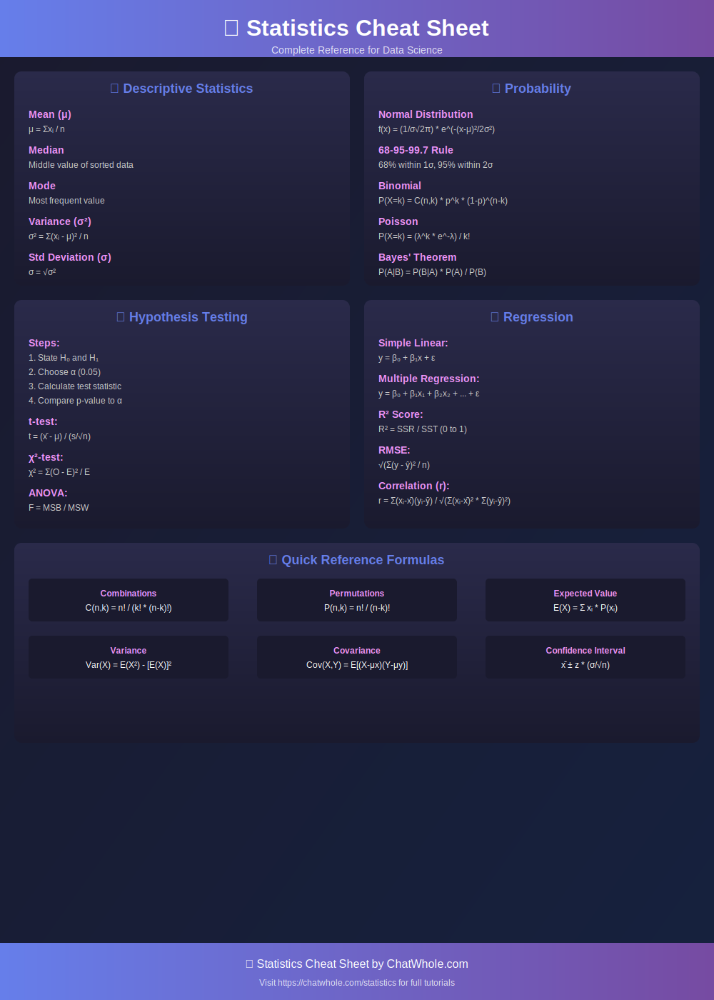

# 📊 Statistics for Data Science

<p align="center">
  
</p>

## 📚 Table of Contents

1. [Descriptive Statistics](#descriptive-statistics)
2. [Probability Distributions](#probability-distributions)
3. [Hypothesis Testing](#hypothesis-testing)
4. [Regression Analysis](#regression-analysis)
5. [Bayesian Statistics](#bayesian-statistics)

---

## 🎯 Descriptive Statistics

### Measures of Central Tendency

| Measure | Formula | Use Case |
|---------|---------|----------|
| **Mean** | μ = Σxᵢ/n | Symmetric distributions |
| **Median** | Middle value | Skewed distributions |
| **Mode** | Most frequent | Categorical data |

### Measures of Dispersion

| Measure | Formula | Description |
|---------|---------|-------------|
| **Range** | max - min | Total spread |
| **Variance** | σ² = Σ(xᵢ-μ)²/n | Average squared deviation |
| **Std Dev** | σ = √σ² | Average deviation |
| **IQR** | Q3 - Q1 | Middle 50% spread |

---

## 📈 Probability Distributions

### Normal Distribution

```
f(x) = (1/σ√2π) * e^(-(x-μ)²/2σ²)
```

- **Mean = Median = Mode**
- **68-95-99.7 Rule**: 68% within 1σ, 95% within 2σ, 99.7% within 3σ

### Common Distributions

| Distribution | Parameters | Use Case |
|--------------|------------|----------|
| Normal | μ, σ | Natural phenomena |
| Binomial | n, p | Success/failure trials |
| Poisson | λ | Event counts |
| Exponential | λ | Waiting times |
| Uniform | a, b | Equal probability |

---

## 🔬 Hypothesis Testing

### Steps

1. **State Hypotheses**
   - H₀: Null hypothesis (no effect)
   - H₁: Alternative hypothesis

2. **Choose Significance Level**
   - α = 0.05 (5% chance of Type I error)

3. **Calculate Test Statistic**
   - z-test, t-test, χ²-test

4. **Make Decision**
   - p-value < α → Reject H₀

### Common Tests

| Test | When to Use | Formula |
|------|-------------|---------|
| **t-test** | Compare means | t = (x̄ - μ) / (s/√n) |
| **χ²-test** | Categorical association | χ² = Σ(O-E)²/E |
| **ANOVA** | Compare 3+ means | F = MSB/MSW |

---

## 📉 Regression Analysis

### Simple Linear Regression

```
y = β₀ + β₁x + ε
```

- **β₁ = Σ(xᵢ-x̄)(yᵢ-ȳ) / Σ(xᵢ-x̄)²**
- **β₀ = ȳ - β₁x̄**

### Multiple Regression

```
y = β₀ + β₁x₁ + β₂x₂ + ... + βₖxₖ + ε
```

### Model Evaluation

| Metric | Formula | Interpretation |
|--------|---------|----------------|
| **R²** | SSR/SST | Variance explained |
| **Adjusted R²** | 1-(1-R²)(n-1)/(n-k-1) | Penalizes complexity |
| **RMSE** | √(Σ(y-ŷ)²/n) | Average error |

---

## 🧠 Bayesian Statistics

### Bayes' Theorem

```
P(A|B) = P(B|A) * P(A) / P(B)
```

- **Prior**: P(A) - Initial belief
- **Likelihood**: P(B|A) - Evidence
- **Posterior**: P(A|B) - Updated belief

---

## 🔗 Related Resources

| Resource | Link |
|----------|------|
| 📊 Statistics Tutorial | [ChatWhole.com/statistics](https://chatwhole.com/statistics) |
| 🐍 Python for Stats | [ChatWhole.com/python](https://chatwhole.com/python) |
| 📈 Data Visualization | [ChatWhole.com/data-visualization](https://chatwhole.com/data-visualization) |

---

<p align="center">
  <a href="https://chatwhole.com">← Back to ChatWhole.com</a>
</p>
